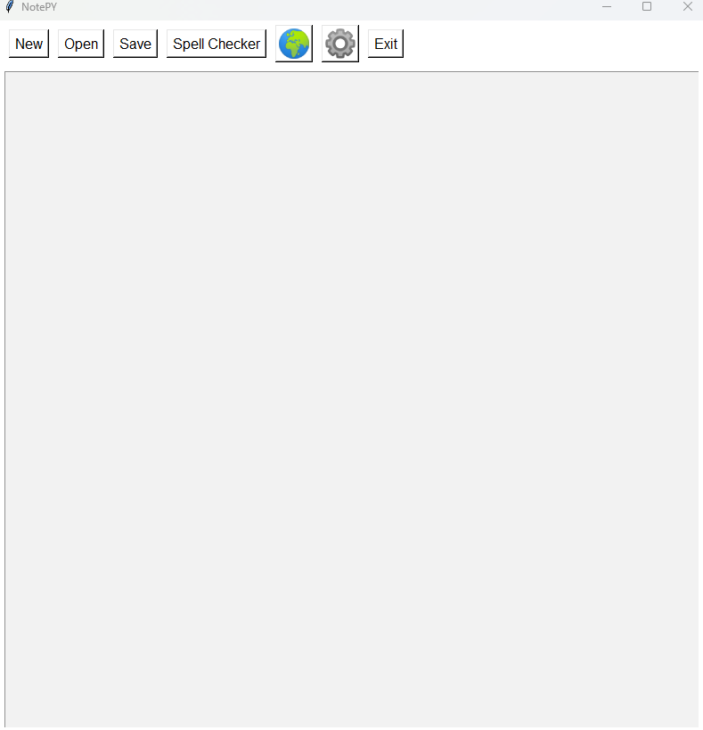

# Hi there, I'm Yahya! 👋

Welcome to my GitHub profile! I am a passionate programming, series, films, comics and games. Here you'll find some of my personal projects.

## 🌱 About Me

- 🌱 I’m currently learning ML, XR.
- 💬 Ask me about everything and make me research.
- ⚡ Fun fact: Fan of Nightwing.

## 🚀 Projects

Here are some of the projects I've made:

### [NotePY](https://github.com/yahyaozsoy/NotePY)
This is another type of "Notepad but With Python" thing.

### [Hand Gesture Recognition](https://github.com/yahyaozsoy/Hand-Gesture-Recognition)
Yet Another Hand Gesture Recognition System

## 📈 GitHub Stats

## 🛠️ Skills

- Programming Languages: C, C#, CSS, HTML, Javascript, Python.
- Tools and Technologies: Unity, Unreal Engine, CryEngine, Vuforia, Flutter, Android Studio...
- Frameworks: React, Vite.

## 🤝 Connect with Me

I love connecting with fellow developers and sharing knowledge. Feel free to reach out to me via:

- Email: yahyaozsoyy@gmail.com
- 𝕏.com 😂: [@YahyaOzsoy_](https://x.com/YahyaOzsoy_)
- : [Yahya ÖZSOY](https://www.linkedin.com/in/yahya-ozsoy)

---
Feel free to star ⭐️ this repository if you found it helpful!
